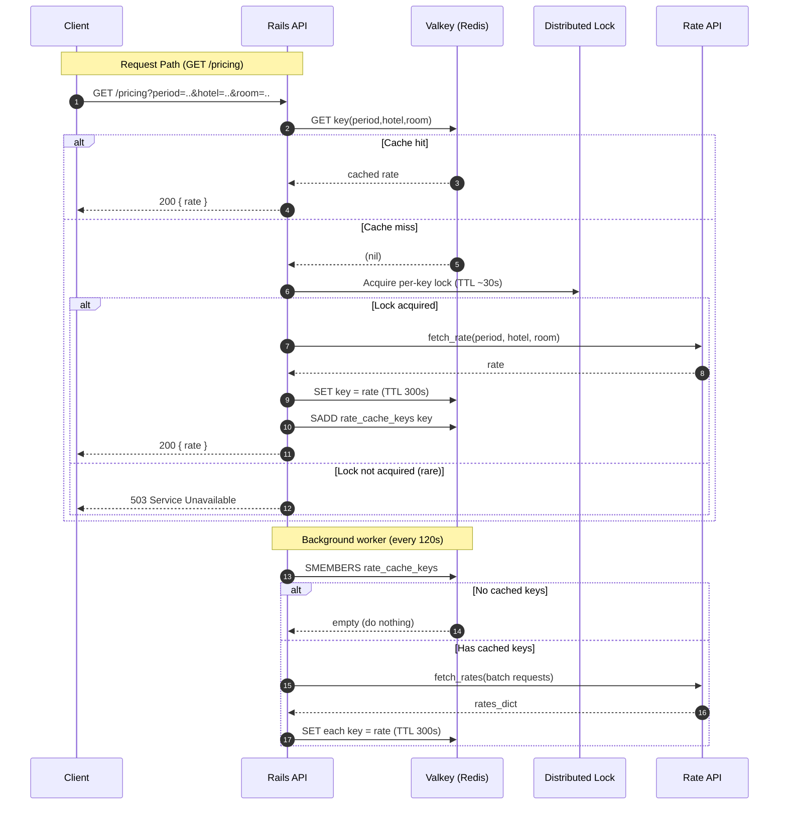

# Dynamic Pricing Proxy

## The Challenge

A dynamic pricing model is used for hotel rooms. Instead of static, unchanging rates, a model uses a real-time algorithm to adjust prices based on market demand and other data signals. This helps us maximize both revenue and occupancy.

A Data and AI team built a powerful model to handle this, but its inference process is computationally expensive to run. To make this product more cost-effective, we analyzed the model's output and found that a calculated room rate remains effective for up to 5 minutes.

This efficient service that acts as an intermediary to the dynamic pricing model. This service will be responsible for providing rates to the users while respecting the operational constraints of the expensive model behind it.

## Core Requirements

1.  Integrate the Pricing Model: Modify the provided service to call the external dynamic pricing API to get the latest rates. The model is available as a Docker image: [tripladev/rate-api](https://hub.docker.com/r/tripladev/rate-api).

2.  Ensure Rate Validity: A rate fetched from the pricing model is considered valid for 5 minutes. The service must ensure that any rate it provides for a given set of parameters (`period`, `hotel`, `room`) is no older than this 5-minute window.

3.  Respect External Model Capacity: The external `rate-api` can process at most 1,000 requests per day per API token. Do not exceed this cap; serve additional demand using caching and request coalescing. Reference: [tripladev/rate-api](https://hub.docker.com/r/tripladev/rate-api).

4.  Scale the Proxy: The proxy must handle at least 10,000 requests per day and should scale horizontally (multiple instances behind a load balancer) to support millions of requests per day while maintaining the 5-minute rate validity constraint.

## Architecture and SWR Caching

- Caching strategy (SWR):
  - Fast path (stale data): if a requested `(period, hotel, room)` is cached, the API returns it immediately.
  - Miss path: on cache miss, we acquire a short-lived distributed lock (per key), fetch from the upstream Rate API, store for 5 minutes (300s), and return the fresh value. This prevents cache stampedes and keeps requests fast.
  - Revalidation: a background worker runs every 2 minutes to batch-refresh all previously requested keys. If there are no cached keys, the worker does nothing.

- Data validity and refresh cadence:
  - Cache TTL is 5 minutes.
  - Worker refresh runs every 2 minutes, so stale values are refreshed well before expiry in normal operation.

- Quota and batching:
  - Upstream limit: 1000 calls/day.
  - 1 day = 24 hours × 60 minutes = 1440 minutes; with a 2-minute interval there are 720 refresh cycles/day.
  - The batch endpoint accepts an array of parameter sets. For this API the domain is bounded: 4 periods × 3 hotels × 3 rooms = 36 maximum combinations.
  - Therefore, in a single day, the total number of API calls is bounded by 720 (worker) + 36 (first-time misses) = 756, well under the 1000 limit.

- Behavior with no cached keys:
  - The worker does nothing if no keys were requested yet. New keys are populated on-demand by request-path misses.

## API Endpoint

GET `/pricing?period=Summer&hotel=FloatingPointResort&room=SingletonRoom`

- Allowed values:
  - `period`: `Summer`, `Autumn`, `Winter`, `Spring`
  - `hotel`: `FloatingPointResort`, `GitawayHotel`, `RecursionRetreat`
  - `room`: `SingletonRoom`, `BooleanTwin`, `RestfulKing`

Responses:
- 200 `{ "rate": "<value>" }`
- 400 Problem Details (invalid parameters)
- 503 Problem Details (temporary unavailability)

## Development Environment Setup

The project scaffold is a minimal Ruby on Rails application with a `/pricing` endpoint. This repository is pre-configured for a Docker-based workflow that supports live reloading for your convenience.

The provided `Dockerfile` builds a container with all necessary dependencies. Your local code is mounted directly into the container, so any changes you make on your machine will be reflected immediately. Your application will need to communicate with the external pricing model, which also runs in its own Docker container.

## Quick Start Guide

### 1) Build the Rails app image

Use the helper script to build the Rails API image from `dynamic-pricing/`.

```bash
./build.sh
```

This produces a local image named `dynamic-pricing-proxy`.

### 2) Start the full dev stack

Use docker-compose via the helper script. This:
- mounts `dynamic-pricing/` into the Rails container for live reload
- starts the Rails API, the external rate API, Valkey (Redis-compatible), and RedisInsight

```bash
./dev.sh
```

To view logs:
```bash
docker compose logs -f | cat
```

### 3) Test the pricing endpoint

```bash
curl 'http://localhost:3000/pricing?period=Summer&hotel=FloatingPointResort&room=SingletonRoom'
```

### 4) Run tests

Use the helper script, which runs the full suite inside the running app container:
```bash
./test.sh
```

Run a specific test file:
```bash
docker exec -it dynamic-pricing-proxy ./bin/rails test test/controllers/pricing_controller_test.rb
```

Run a specific test by name:
```bash
docker exec -it dynamic-pricing-proxy ./bin/rails test test/controllers/pricing_controller_test.rb -n test_should_get_pricing_with_all_parameters
```

## Service Ports

| Service         | Container Name           | Host Port | Container Port |
|-----------------|--------------------------|-----------|----------------|
| Rails API       | `dynamic-pricing-proxy`  | 3000      | 3000           |
| Rate API        | `rate-api`               | 8080      | 8080           |
| Valkey (Redis)  | `valkey`                 | 6379      | 6379           |
| RedisInsight    | `redisinsight`           | 5540      | 5540           |

## Teardown

Stop and remove all services started by docker-compose:
```bash
./teardown.sh
```

If you need to remove containers, networks, and volumes forcefully:
```bash
docker compose down -v --remove-orphans
```

## Sequence Diagram (SWR Request + Worker Refresh)


