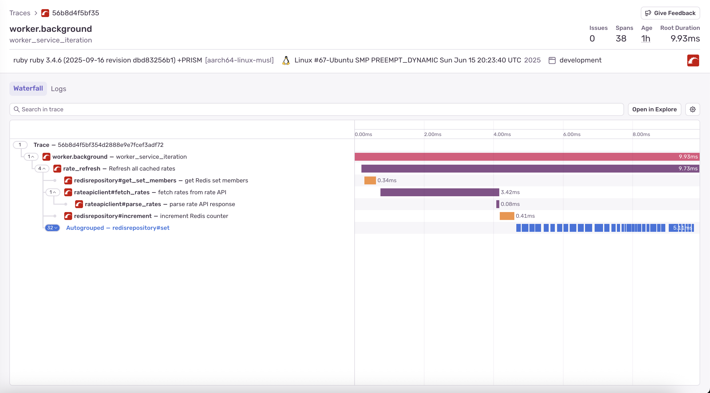

# Dynamic Pricing Proxy

## Quick Start Guide

This Ruby on Rails app exposes a `/pricing` endpoint and comes pre-configured for a Docker-based workflow with live reloading.

The Dockerfile builds a container with all dependencies, mounting your local code so changes appear instantly. The app communicates with the external pricing model, which runs in a separate Docker container.

### 1) Build the Rails app image

Use the helper script to build the Rails API image from `dynamic-pricing/`.

```bash
./build.sh
```

This produces a local image named `dynamic-pricing-proxy`.

### 2) Start the full dev stack

Use docker-compose via the helper script. This:
- mounts `dynamic-pricing/` into the Rails container for live reload
- starts the Rails API, the external rate API, Valkey (Redis-compatible), and RedisInsight

```bash
./dev.sh
```

To view logs:
```bash
docker compose logs -f | cat
```

### 3) Test the pricing endpoint

```bash
curl 'http://localhost:3000/pricing?period=Summer&hotel=FloatingPointResort&room=SingletonRoom'
```

### 4) Run tests

Use the helper script, which runs the full suite inside the running app container:
```bash
./test.sh
```

Run a specific test file:
```bash
docker exec -it dynamic-pricing-proxy ./bin/rails test test/controllers/pricing_controller_test.rb
```

Run a specific test by name:
```bash
docker exec -it dynamic-pricing-proxy ./bin/rails test test/controllers/pricing_controller_test.rb -n test_should_get_pricing_with_all_parameters
```

## Service Ports

| Service         | Container Name           | Host Port | Container Port |
|-----------------|--------------------------|-----------|----------------|
| Rails API       | `dynamic-pricing-proxy`  | 3000      | 3000           |
| Rate API        | `rate-api`               | 8080      | 8080           |
| Valkey (Redis)  | `valkey`                 | 6379      | 6379           |
| RedisInsight    | `redisinsight`           | 5540      | 5540           |

## Teardown

Stop and remove all services started by docker-compose:
```bash
./teardown.sh
```

If you need to remove containers, networks, and volumes forcefully:
```bash
docker compose down -v --remove-orphans
```

## API Endpoint

GET `/pricing?period=Summer&hotel=FloatingPointResort&room=SingletonRoom`

- Allowed values:
  - `period`: `Summer`, `Autumn`, `Winter`, `Spring`
  - `hotel`: `FloatingPointResort`, `GitawayHotel`, `RecursionRetreat`
  - `room`: `SingletonRoom`, `BooleanTwin`, `RestfulKing`

Responses:

- **200 OK** - Successful response with calculated rate
  ```json
  { "rate": "125.75" }
  ```

- **400 Bad Request** - Invalid request parameters (follows [RFC 7231 Section 6.5.1](https://datatracker.ietf.org/doc/html/rfc7231#section-6.5.1))
  - Returned when query parameters contain invalid values outside the allowed set
  - Response follows [RFC 7807 Problem Details](https://datatracker.ietf.org/doc/html/rfc7807) format:
  ```json
  {
    "type": "https://datatracker.ietf.org/doc/html/rfc7231#section-6.5.1",
    "title": "One or more validation errors occurred.",
    "instance": "/pricing",
    "traceId": "abc-123-def-456",
    "errors": {
      "period": ["must be one of: Summer, Autumn, Winter, Spring"],
      "hotel": ["must be one of: FloatingPointResort, GitawayHotel, RecursionRetreat"],
      "room": ["must be one of: SingletonRoom, BooleanTwin, RestfulKing"]
    }
  }
  ```

- **503 Service Unavailable** - Temporary service unavailability (follows [RFC 7231 Section 6.6.4](https://datatracker.ietf.org/doc/html/rfc7231#section-6.6.4))
  - Returned when the service cannot acquire a distributed lock to fetch fresh data
  - Response follows [RFC 7807 Problem Details](https://datatracker.ietf.org/doc/html/rfc7807) format:
  ```json
  {
    "type": "https://datatracker.ietf.org/doc/html/rfc7231#section-6.6.4",
    "title": "Service Temporarily Unavailable",
    "instance": "/pricing",
    "traceId": "xyz-789-uvw-012"
  }
  ```

## Architecture

- This project employs modern caching strategy with SWR (Stale-While-Revalidating):
  - Fast path (stale data): if a requested `(period, hotel, room)` is cached, the API returns it immediately.
  - On cache miss, we acquire a short-lived distributed lock (per key), fetch from the upstream Rate API, store for 5 minutes (300s), and return the fresh value. This prevents cache stampedes and keeps requests fast for end-users.
  - Revalidation: a background worker runs every 2 minutes to batch-refresh all previously requested keys. If there are no cached keys, the worker does nothing.

- Data validity and refresh cadence:
  - Cache TTL is 5 minutes.
  - Worker refresh runs every 2 minutes, so stale values are refreshed well before expiry in normal operation.

- Quota and batching:
  - Upstream limit: 1000 calls/day.
  - 1 day = 24 hours × 60 minutes = 1440 minutes; with a 2-minute interval there are 720 refresh cycles/day.
  - The batch endpoint accepts an array of parameter sets. For this API the domain is bounded: 4 periods × 3 hotels × 3 rooms = 36 maximum combinations.
  - Therefore, in a single day, the total number of API calls is bounded by 720 (worker) + 36 (first-time misses) = 756, well under the 1000 limit.

- Behavior with no cached keys:
  - The worker does nothing if no keys were requested yet. New keys are populated on-demand by request-path misses.

## Sequence Diagram


The traces below illustrate typical request flows captured by Sentry in waterfall format, reflecting the real-world execution of the sequence diagram shown above:

### Cache Hit


### Cache Miss


### Background Worker


> See more about Sentry.io integration in [Distributed Tracing](#distributed-trace) section below

## Frontend User Interface

The project includes a modern Next.js React-based frontend application (`dynamic-pricing-ui/`) that provides a complete user experience for testing and monitoring the dynamic pricing proxy.


### Running the Frontend

To start the frontend development server:

```bash
brew install fnm
fnm install
fnm use
npm install -g pnpm
cd dynamic-pricing-ui
pnpm install
pnpm dev
```

The UI will be available at `http://localhost:3001`.

### Capabilities

The frontend application provides comprehensive testing and monitoring tools:

#### 🧮 **Pricing Calculator**
- Interactive form to test pricing requests with all valid (and invalid) parameter combinations
- Real-time rate calculation display
- Validation and error handling
- Last updated timestamp tracking

#### 📊 **System Health & Metrics Dashboard**
- Real-time system status monitoring (API status, Redis connectivity)
- Live metrics display (quota usage, API call counts, hit rates)
- Visual indicators for system health
- Auto-refreshing data with configurable intervals
- Animated circular progress indicator to next refresh time

#### ⚡ **Stress Testing Suite**
- **Comprehensive Burst Test**: 360 concurrent requests testing all parameter combinations
- **Randomized Sustained Test**: 1 million sequential requests for load testing
- Real-time progress tracking with animated progress bars
- Detailed performance metrics (success rates, response times, throughput)

### Backend-for-Frontend (BFF) Architecture

This app implements an API Gateway pattern that forwards requests from `localhost:3001` to `localhost:3000` (Dynamic Pricing Proxy Rails API). This approach:

- ✅ **Bypasses CORS restrictions** - more secure
- ✅ **Enhances security** - allows not exposing public API directly and allows OAuth 2.0 Proxy to be implemented in the future
- ✅ **Separation of concerns** - API calls to microservices can be aggregated in `/api` routes in the front-end.

## The Challenge

We use a dynamic pricing model for hotel rooms, where a real-time algorithm adjusts rates based on demand and other signals to maximize both revenue and occupancy.

The Data & AI team built a powerful model for this, but its inference process is computationally expensive. Our analysis showed that calculated rates remain effective for up to five minutes.

To optimize costs, we introduced an intermediary service that delivers rates to users while minimizing calls to the expensive model and respecting its operational constraints.

## Core Requirements

1.  Integrate the Pricing Model: Modify the provided service to call the external dynamic pricing API to get the latest rates. The model is available as a Docker image: [tripladev/rate-api](https://hub.docker.com/r/tripladev/rate-api).

2.  Ensure Rate Validity: A rate fetched from the pricing model is considered valid for 5 minutes. The service must ensure that any rate it provides for a given set of parameters (`period`, `hotel`, `room`) is no older than this 5-minute window.

3.  Respect External Model Capacity: The external `rate-api` can process at most 1,000 requests per day per API token. Do not exceed this cap; serve additional demand using caching and request coalescing. Reference: [tripladev/rate-api](https://hub.docker.com/r/tripladev/rate-api).

4.  Scale the Proxy: The proxy must handle at least 10,000 requests per day and should scale horizontally (multiple instances behind a load balancer) to support millions of requests per day while maintaining the 5-minute rate validity constraint.

## Distributed Trace

The application is instrumented with [Sentry.io](https://sentry.io/) for distributed tracing and error monitoring. Sentry automatically captures performance traces showing the flow between the Rails API, Redis cache, distributed locks, and external Rate API.

In addition, Sentry provides centralized logging and automatic error triage for both the web application and background worker processes.

To enable Sentry tracing in your local environment, set the `SENTRY_DSN` environment variable:

```bash
export SENTRY_DSN="https://your-dsn@sentry.io/project-id"
```

If no `SENTRY_DSN` is provided, the application will continue to run normally without Sentry (it will only log a warning message).

## Docker Images

### Automated Image Publishing

Docker images are automatically built and published to GitHub Packages whenever changes are pushed to the `main` branch:

#### API Service
```bash
# Pull the latest API image
docker pull ghcr.io/ryanelian/mitsu/dynamic-pricing-proxy:latest

# Run the API container
docker run -p 3000:3000 ghcr.io/ryanelian/mitsu/dynamic-pricing-proxy:latest
```

#### UI Service
```bash
# Pull the latest UI image
docker pull ghcr.io/ryanelian/mitsu/dynamic-pricing-ui:latest

# Run the UI container
docker run -p 3001:3000 ghcr.io/ryanelian/mitsu/dynamic-pricing-ui:latest
```

## Kubernetes Deployment

The application can be deployed to Kubernetes using the provided configuration files in the `kubernetes/` directory. This setup demonstrates horizontal scaling and load balancing across multiple replicas.

### Prerequisites

- Kubernetes cluster (tested with colima)
- kubectl configured to access your cluster

> **💡 Recommendation for Mac Users:**
>
> I recommend using [Colima](https://github.com/abiosoft/colima) - it's free and comes with [k3s](https://k3s.io/), a CNCF-certified, production-grade, lightweight Kubernetes distribution.
>
> Colima automatically binds LoadBalancer and NodePort services to your host machine, making local development seamless.
>
> Install and start Colima with Kubernetes:
> ```bash
> # Start Colima with Kubernetes (8 CPU, 16GB RAM recommended for this demo)
> colima start --cpu 8 --memory 16 --kubernetes
> ```
>
> ⚠️ **Resource Requirements Warning:**
>
> The Kubernetes deployment in this project is configured with **8 replicas** of the Dynamic Pricing Proxy for load balancing demonstration. This setup requires significant system resources:
>
> - **Minimum**: 8 CPU cores, 16GB RAM (as configured for Colima above)
> - **Recommended Machine**: 12+ CPU cores, 48+ GB RAM Macbook Pro for stable operation
>
> If your machine doesn't have enough resources, the pods may enter crash loops due to out-of-memory (OOM) errors or CPU starvation. Consider scaling down replicas before deployment.

### Deploy to Kubernetes

```bash
kubectk apply -k ./kubernetes
```

This will deploy:
- **Dynamic Pricing Proxy** (Rails API) - 8 replicas with load balancing
- **Dynamic Pricing UI** (Next.js Server) - 2 replicas with load balancing
- **Rate API** - External pricing model service
- **Valkey** Redis-compatible cache
- **RedisInsight** - Web-based Redis admin interface
- **Worker Service** - Background job processor

### Load Balancing Demonstration

[](https://youtu.be/69VZqcftfu0)

The deployment demonstrates effective load balancing across multiple replicas. Here's an example of the running pods:

```bash
kubectl get pods -n dynamic-pricing
```

```log
NAME                                    READY   STATUS    RESTARTS   AGE
dynamic-pricing-proxy-cc6bd8c8b-72lxt   1/1     Running   0          2m30s
dynamic-pricing-proxy-cc6bd8c8b-76vqw   1/1     Running   0          2m30s
dynamic-pricing-proxy-cc6bd8c8b-7jfsp   1/1     Running   0          2m30s
dynamic-pricing-proxy-cc6bd8c8b-g9plq   1/1     Running   0          2m30s
dynamic-pricing-proxy-cc6bd8c8b-gk78m   1/1     Running   0          2m30s
dynamic-pricing-proxy-cc6bd8c8b-glqhc   1/1     Running   0          2m30s
dynamic-pricing-proxy-cc6bd8c8b-l5q92   1/1     Running   0          2m30s
dynamic-pricing-proxy-cc6bd8c8b-wl57z   1/1     Running   0          2m30s
dynamic-pricing-ui-6b5d9bcb4f-ls82j     1/1     Running   0          2m30s
dynamic-pricing-ui-6b5d9bcb4f-x2td2     1/1     Running   0          2m30s
rate-api-6f5bd699c-gcl79                1/1     Running   0          2m30s
redisinsight-5c687b8486-vs4wk           1/1     Running   0          2m30s
valkey-849d94c989-qvsl5                 1/1     Running   0          2m30s
worker-service-67c4bdd8bf-grllp         1/1     Running   0          2m29s
```

### Horizontal Scaling

The beauty of Kubernetes is its ability to scale applications horizontally by adjusting the number of replicas for any deployment:

**Scale UP (to handle more load):**
```yaml
apiVersion: apps/v1
kind: Deployment
metadata:
  name: dynamic-pricing-proxy
  namespace: dynamic-pricing
spec:
  replicas: 100  # Increase from 8 to 100
```

By simply changing the `replicas` value in the deployment configuration (currently set to 8 for the proxy), Kubernetes will automatically create or destroy pods to match your desired scale.

This allows the application to handle traffic from dozens to millions of users without any code changes.

> **💡 Pro Tip:** With managed Kubernetes services like AWS EKS, you can enable Auto-Scaling (such as with Karpenter) that will automatically provision additional nodes when your cluster needs more capacity. This makes horizontal scaling truly "set it and forget it" - the system will scale both pods and infrastructure as needed.

### Vertical Scaling

You can also scale vertically by adjusting the resource requests and limits in the deployment configuration:

**Scale UP (more resources):**
```yaml
apiVersion: apps/v1
kind: Deployment
metadata:
  name: dynamic-pricing-proxy
  namespace: dynamic-pricing
spec:
  template:
    spec:
      containers:
      - name: dynamic-pricing-proxy
        resources:
          requests:
            memory: "1Gi"  # Up from 256Mi
            cpu: "1000m"   # Up from 100m
          limits:
            memory: "4Gi"  # Up from 512Mi
            cpu: "4000m"   # Up from 500m
```

The current deployment configuration sets:
- **Requests**: 256Mi memory, 100m CPU
- **Limits**: 512Mi memory, 500m CPU

Adjusting these values allows you to optimize resource utilization based on your actual workload patterns and available infrastructure.

> **📝 CPU Units Explained:**
> - **100m** = 0.1 CPU cores = **10%** of one CPU core
> - **500m** = 0.5 CPU cores = **50%** of one CPU core
> - **1000m** = 1 CPU core = **100%** of one CPU core
> - **2000m** = 2 CPU cores = **200%** (across multiple cores)

### Access the Application

The Kubernetes deployment follows a typical microservices architecture where backend APIs are intentionally hidden behind an API Gateway.

In this case, the **Next.js frontend serves as the API Gateway**, providing a unified entry point while keeping the backend services secure and internal.

#### Backend API Access

The Dynamic Pricing Proxy Rails API is **not directly exposed** to the outside world. Instead, you access it through the Next.js API Gateway:

- **API Gateway URL**: `http://localhost:30702/api/dynamic-pricing/`
- **Pricing Endpoint**: `http://localhost:30702/api/dynamic-pricing/pricing?period=Summer&hotel=FloatingPointResort&room=SingletonRoom`

The API Gateway removes the need for CORS, handles authentication if needed, and manages request routing to the internal Rails API service.

#### Exposed Services

Only the frontend UI and monitoring tools are exposed externally:

| Service         | Kubernetes Service       | NodePort | Container Port | Description |
|-----------------|--------------------------|----------|----------------|-------------|
| Frontend UI     | `dynamic-pricing-ui-service` | 30702    | 3000           | Next.js application with API Gateway |
| RedisInsight    | `redisinsight-service`   | 30701    | 5540           | Web-based Redis admin interface |

### Cleanup

Remove all deployed resources:

```bash
kubectl delete -k ./kubernetes/
```
